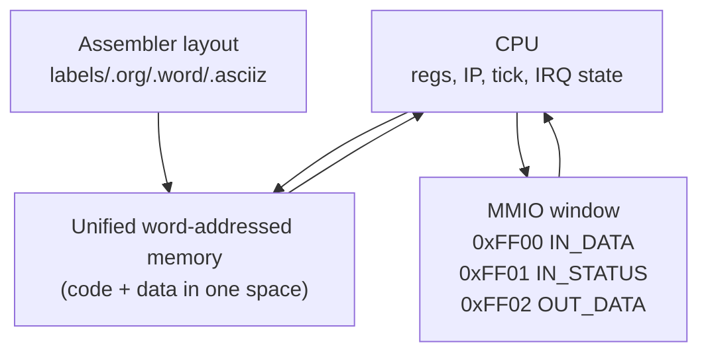
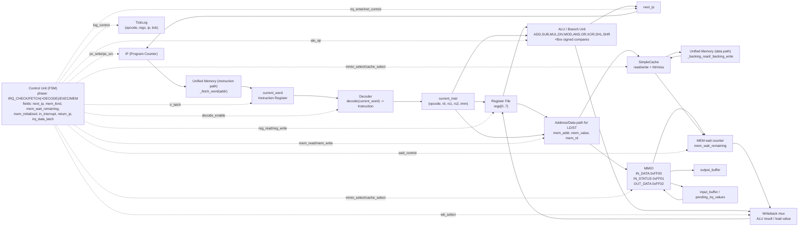
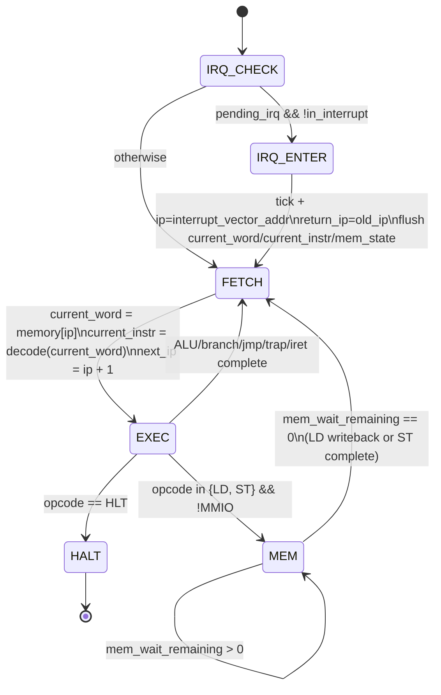

# Лабораторная работа №4

**Студент:** Смирнов Вадим Константинович  
**Группа:** P3219  
**Преподаватель:** *(укажите ФИО)*  
**Вариант:**

```text
asm | risc | neum | hw | tick | binary | trap | mem | cstr | prob1 | cache
```

---

Проект реализует полный учебный стек лабораторной №4: ассемблероподобный язык `asm`, транслятор в бинарный формат, и потактовую модель процессора `risc/neum/hw` с `trap`, `mem`-MMIO и `cache`. Цепочка работы: `source.asm -> assembler -> binary/listing -> CPU simulation -> output/log`.

### Кратко (TL;DR)

- Вход проекта: ASM-программа, опционально входной поток байт и расписание IRQ.
- Выход транслятора: `words`, бинарник `.bin`, листинг `.lst`.
- Выход симулятора: `output_buffer`, финальное состояние CPU/памяти, `TickLog`.
- Модель CPU фазовая: `IRQ_CHECK -> FETCH(+DECODE) -> EXEC -> MEM`.
- Кеш direct-mapped write-through, MMIO в адресном окне `0xFF00..0xFF02`.
- Покрытие поведения подтверждается unit/integration/golden тестами.

---

## Структура проекта

```text
src/
  ak_lab4/
    __init__.py
    isa/
      __init__.py
      model.py
    translator/
      __init__.py
      types.py
      parser.py
      preprocess.py
      encoding.py
      assembler.py
      pipeline.py      # compat wrapper
      cli.py
    simulator/
      __init__.py
      core.py
      cache.py
      io.py
      loader.py
      cli.py
      __main__.py
    isa_core.py          # compat wrapper
    translator_core.py   # compat wrapper
    machine_core.py      # compat wrapper
    machine.py           # public API wrapper

tests/
golden/
```

Основная логика расположена в пакете `src/ak_lab4`.

### Ответственность модулей

- `isa/model.py` — формат инструкций и encode/decode.
- `translator/preprocess.py` — макросы и условная компиляция.
- `translator/parser.py` — лексико-синтаксический разбор строк ASM.
- `translator/encoding.py` — валидация, pass1 и отображение в `Instruction`.
- `translator/assembler.py` — сборочный pipeline + CLI.
- `simulator/core.py` — цикл исполнения CPU.
- `simulator/cache.py` — direct-mapped cache (write-through).
- `simulator/io.py` — MMIO-карта.
- `simulator/loader.py` — загрузка бинарного кода.
- `simulator/cli.py` — запуск модели процессора из CLI.

---

## Язык программирования

Реализован ассемблероподобный язык (`asm`) с поддержкой:

- меток;
- секций `.text` и `.data`;
- директив `.org`, `.equ`, `.word`, `.asciiz`;
- пользовательских макроопределений (`.macro ... .endm`);
- условной компиляции (`.if/.else/.endif`);
- комментариев `; ...`.

### Синтаксис (БНФ)

```bnf
<program> ::= <line> | <line> <program>

<line> ::= <empty-line>
         | <comment-line>
         | <label-line>
         | <instruction-line>
         | <directive-line>

<empty-line> ::= <EOL>
<comment-line> ::= <ws-opt> ";" <text-opt> <EOL>
<label-line> ::= <label-def> <ws-opt> <comment-opt> <EOL>
<instruction-line> ::= <instruction> <ws-opt> <comment-opt> <EOL>
<directive-line> ::= <directive> <ws-opt> <comment-opt> <EOL>

<instruction> ::= "HLT"
               | "IRET"
               | ("ADD" | "SUB" | "MUL" | "DIV" | "MOD") <ws-plus> <reg> <sep> <reg> <sep> <reg>
               | ("AND" | "OR" | "XOR" | "SHL" | "SHR") <ws-plus> <reg> <sep> <reg> <sep> <reg>
               | "ADDI" <ws-plus> <reg> <sep> <reg> <sep> <imm>
               | ("LD" | "ST") <ws-plus> <reg> <sep> <reg>
               | ("BEQ" | "BNE" | "BGT" | "BLT" | "BLE" | "BGE") <ws-plus> <reg> <sep> <reg> <sep> <imm>
               | ("JMP" | "TRAP") <ws-plus> <imm>

<directive> ::= ".text"
              | ".data"
              | ".org" <ws-plus> <imm>
              | ".equ" <ws-plus> <ident> <sep> <imm>
              | ".word" <ws-plus> <imm>
              | ".asciiz" <ws-plus> <string>
              | ".macro" <ws-plus> <ident> <macro-params-opt>
              | ".endm"
              | ".if" <ws-plus> <imm-or-const>
              | ".else"
              | ".endif"

<macro-params-opt> ::= "" | <ws-plus> <ident> | <ws-plus> <ident> <sep> <ident-list>
<ident-list> ::= <ident> | <ident> <sep> <ident-list>
<imm-or-const> ::= <imm> | <ident>

<reg> ::= "%" <register>
<register> ::= "R0" | "R1" | "R2" | "R3" | "R4" | "R5" | "R6" | "R7"

<imm> ::= <number> | <label>
<label-def> ::= <label> ":"
<label> ::= <ident>
<ident> ::= <ident-start> <ident-tail>
<ident-tail> ::= "" | <ident-char> <ident-tail>
<ident-start> ::= <letter> | "_"
<ident-char> ::= <ident-start> | <digit>

<number> ::= <sign-opt> <digits>
<sign-opt> ::= "" | "-"
<digits> ::= <digit> | <digit> <digits>
<string> ::= "\"" <string-chars> "\""
<string-chars> ::= "" | <string-char> <string-chars>

<comment-opt> ::= "" | ";" <text-opt>
<text-opt> ::= "" | <text-char> <text-opt>
<sep> ::= <ws-opt> "," <ws-opt>
<ws-plus> ::= <ws> | <ws> <ws-plus>
<ws-opt> ::= "" | <ws-plus>
<ws> ::= " " | "\t"
<EOL> ::= "\n" | "\r\n"
```

### Семантика

- Стратегия вычислений: последовательное выполнение инструкций по `IP`.
- Область видимости меток и констант (`.equ`) — глобальная в рамках файла.
- Тип данных: 32-битное машинное слово.
- Строки: `cstr` (`.asciiz`) — по символу на слово + завершающий `0`.
- Для условных ветвлений `BGT/BLT/BLE/BGE` сравнение выполняется в signed32-семантике.

---

## Организация памяти

Архитектура памяти: `neum` (фон Нейман), код и данные в одном адресном пространстве.

- Машинное слово: 32 бита (4 байта).
- Адресация: по индексу машинного слова.
- Программа и данные размещаются транслятором в едином массиве слов с учетом `.org`.

### Параметры модели памяти

| Параметр | Значение |
|---|---|
| Тип памяти | Единая (Von Neumann, `neum`) |
| Разрядность слова | 32 бита |
| Единица адресации | 1 машинное слово |
| Начальный адрес кода | `IP = 0` (или явно заданный тестом) |
| Размещение секций | через линковку адресов в assembler (`.org`, метки, директивы данных) |

### Раскладка памяти

```text
                 Registers
+------------------------------+
| R0..R7 : general-purpose     |
| IP     : program counter     |
| return_ip, in_interrupt      |
| tick, phase, mem_*           |
+------------------------------+

      Unified memory (word-addressed)
+----------------------------------------------+
| 0x0000 ...           : user code (.text)     |
| .org relocated area  : code/data by assembler|
| .data/.word/.asciiz  : constants and strings |
| ...                                        ...|
| 0xFF00               : MMIO_IN_DATA          |
| 0xFF01               : MMIO_IN_STATUS        |
| 0xFF02               : MMIO_OUT_DATA         |
+----------------------------------------------+
```



### Отображение при компиляции и исполнении

| Сущность | Где формируется | Где хранится/используется |
|---|---|---|
| Инструкции ASM | `translator/assembler.py` | единая память, область кода |
| Метки (`label`) | `pass1_collect_labels` | адреса для `JMP/Bxx` и директив |
| Константы (`.equ`) | `pass1_collect_labels` | подстановка в `imm`/директивы |
| Данные (`.word`) | `assembler.emit` | единая память, адрес по `pc/.org` |
| Строки (`.asciiz`) | `parse_cstr + emit` | последовательность слов + `0` |
| Ввод/вывод | `CPU._read_mmio/_write_mmio` | окно MMIO `0xFF00..0xFF02` |
| Кеш-линии | `simulator/cache.py` | runtime-буфер поверх backing memory |

### Memory-mapped I/O (`mem`)

- `0xFF00` — `MMIO_IN_DATA`,
- `0xFF01` — `MMIO_IN_STATUS`,
- `0xFF02` — `MMIO_OUT_DATA`.

### Регистры

- `R0..R7` — регистры общего назначения;
- `IP` — счетчик команд;
- служебные поля модели: `tick`, `halted`, признак режима прерывания.

---

## Система команд

Архитектура: `risc` (фиксированная длина инструкции, арифметика над регистрами).

### Кодирование (binary)

Каждая инструкция занимает 32 бита:

```text
[31:24] opcode
[23:20] rd
[19:16] rs1
[15:12] rs2
[11:00] imm12 (signed)
```

### Набор инструкций

| Opcode | Мнемоника | Формат | Назначение |
|---|---|---|---|
| `0x00` | `HLT`  | `-` | останов модели |
| `0x01` | `ADD`  | `rd, rs1, rs2` | сложение |
| `0x02` | `SUB`  | `rd, rs1, rs2` | вычитание |
| `0x03` | `LD`   | `rd, rs1` | чтение из памяти/MMIO |
| `0x04` | `ST`   | `rd, rs1` | запись в память/MMIO |
| `0x05` | `BEQ`  | `rs1, rs2, imm` | ветвление при равенстве |
| `0x06` | `JMP`  | `imm` | безусловный переход |
| `0x07` | `TRAP` | `imm` | программный trap-id |
| `0x08` | `IRET` | `-` | возврат из ISR |
| `0x09` | `ADDI` | `rd, rs1, imm` | сложение с immediate |
| `0x0A` | `MUL`  | `rd, rs1, rs2` | умножение |
| `0x0B` | `DIV`  | `rd, rs1, rs2` | деление |
| `0x0C` | `BNE`  | `rs1, rs2, imm` | ветвление при неравенстве |
| `0x0D` | `BGT`  | `rs1, rs2, imm` | ветвление `>` |
| `0x0E` | `MOD`  | `rd, rs1, rs2` | остаток от деления |
| `0x0F` | `AND`  | `rd, rs1, rs2` | побитовое И |
| `0x10` | `OR`   | `rd, rs1, rs2` | побитовое ИЛИ |
| `0x11` | `XOR`  | `rd, rs1, rs2` | побитовое XOR |
| `0x12` | `SHL`  | `rd, rs1, rs2` | логический сдвиг влево |
| `0x13` | `SHR`  | `rd, rs1, rs2` | логический сдвиг вправо |
| `0x14` | `BLT`  | `rs1, rs2, imm` | ветвление `<` |
| `0x15` | `BLE`  | `rs1, rs2, imm` | ветвление `<=` |
| `0x16` | `BGE`  | `rs1, rs2, imm` | ветвление `>=` |

---

## Транслятор

Реализация: `src/ak_lab4/translator/assembler.py`.

### CLI

```bash
python -m src.ak_lab4.translator <input.asm> <output.bin> --listing <output.lst>
```

### Этапы трансляции

1. Очистка комментариев и разбор строк.
2. Препроцессинг: раскрытие `.macro`, обработка `.if/.else/.endif`.
3. Первый проход: сбор меток, учет `.org`, `.equ`.
4. Второй проход: кодирование инструкций и директив в машинные слова.
5. Формирование:
   - бинарного файла (`.bin`);
   - листинга (`.lst`) формата `<addr> - <HEXCODE> - <mnemonic>`.

Валидация транслятора:

- `.org` допускает только неотрицательные адреса;
- проверяются конфликты имён меток и констант;
- для препроцессора проверяются ошибки структуры (`.else/.endif` без `.if`, незакрытые блоки).

---

## Модель процессора

Реализация: `src/ak_lab4/simulator/core.py`.

### CLI

```bash
python -m src.ak_lab4.simulator <program.bin> --input <input.bin> --max-ticks 100000 --detailed-tick
```

| Аргумент/опция | Обязательность | Назначение |
|---|---|---|
| `program.bin` | да | бинарник машинного кода |
| `--input file` | нет | входные байты для MMIO `IN_DATA` |
| `--max-ticks N` | нет | лимит тактов (защита от бесконечного выполнения) |
| `--detailed-tick` | нет | добавлять в лог микрофазы `PHASE_*` |

### Выход симулятора

| Поле | Где | Смысл |
|---|---|---|
| `output_buffer` | `CPU` | байты, записанные в `MMIO_OUT_DATA` |
| `regs`, `ip`, `tick` | `CPU` | финальное состояние модели |
| `logs: TickLog[]` | `CPU` | трасса исполнения по тактам и событиям |
| `halted`, `last_trap` | `CPU` | статус завершения и trap-id |

### Общая логика

- `hw` control unit (hardwired в коде исполнения инструкций);
- цикл разбит на фазы `FETCH(+DECODE) -> EXEC` (+ `MEM` для не-MMIO `LD/ST`);
- режим `tick`: один вызов `CPU.step()` соответствует ровно одному такту/фазе;
- журнал исполнения хранится в `TickLog`.

### Прерывания (`trap`)

Поддержан входной график прерываний: список `(tick, byte)`.

При наступлении события:

1. если процессор не в ISR — выполняется вход в обработчик;
2. сохраняется адрес возврата `return_ip`;
3. `IP` переключается на `interrupt_vector_addr`;
4. в журнал пишется `IRQ_ENTER`.

Возврат из ISR выполняется инструкцией `IRET`.

### Кеш (`cache`)

Реализован простой direct-mapped кеш (`SimpleCache`) с write-through:

- hit: +1 такт;
- miss: +10 тактов;
- для наблюдения в лог пишутся события `CACHE_HIT` и `CACHE_MISS`.

MMIO-доступы кеш не используют.

#### Детализация кеша

| Характеристика | Значение |
|---|---|
| Тип | direct-mapped |
| Линия | `valid`, `tag`, `data` |
| Индексация | `index = addr % lines_count` |
| Тег | `tag = addr // lines_count` |
| Политика записи | write-through |
| Поведение на записи | попадание: обновить line + backing memory, промах: заполнить line + backing memory |

Путь чтения в обычную память:

1. `CPU` формирует `mem_addr`.
2. `SimpleCache.read(addr)` проверяет `valid/tag`.
3. При hit возвращается line data и ставится latency hit.
4. При miss читается backing memory, линия перезаписывается, ставится latency miss.

Путь записи в обычную память:

1. `CPU` формирует `mem_addr` и `mem_value`.
2. `SimpleCache.write(addr, value)` определяет hit/miss.
3. Линия кеша обновляется по адресу.
4. Значение всегда прокидывается в backing memory (write-through).

### Тактовая модель инструкций

В текущей реализации `tick` считается на фазах, а не на «инструкции целиком»:

- каждый тик начинается с проверки IRQ (`PHASE_IRQ_CHECK`);
- немемориальные инструкции проходят `FETCH(+DECODE) + EXEC` (2 такта);
- `LD`/`ST` в обычную память дополнительно переходят в `MEM`-фазу с ожиданием памяти;
- для обычной памяти в `MEM` применяется латентность кеша:
  - `CACHE_HIT`: `1` такт ожидания;
  - `CACHE_MISS`: `10` тактов ожидания;
- MMIO (`0xFF00..0xFF02`) кеш обходят и завершаются в `EXEC` (без отдельной `MEM`-фазы);
- вход в прерывание (`IRQ_ENTER`) — отдельный такт с очисткой текущего pipeline-состояния и прыжком в вектор.

Опционально поддержан подробный режим тактирования (`detailed_tick`): в журнал добавляются микрофазы `PHASE_IRQ_CHECK`, `PHASE_FETCH`, `PHASE_DECODE`, `PHASE_EXEC`, `PHASE_MEM`.

Итого:

- большинство инструкций (`ADD`, `SUB`, `ADDI`, `JMP`, `BEQ`, `TRAP`, `IRET`, и т.д.) — `2` такта;
- `LD`/`ST` (обычная память): `3` такта при hit и `12` тактов при miss;
- `LD`/`ST` (MMIO): `2` такта.

#### Таблица тактов по инструкциям

| Hex | Мнемоника | Такты | Фазы | Примечание |
|---|---|---|---|---|
| `0x00` | `HLT` | `2` | `FETCH(+DECODE), EXEC` | останов модели |
| `0x01` | `ADD` | `2` | `FETCH(+DECODE), EXEC` | `rd <- rs1 + rs2` |
| `0x02` | `SUB` | `2` | `FETCH(+DECODE), EXEC` | `rd <- rs1 - rs2` |
| `0x03` | `LD` | `2 / 3 / 12` | `FETCH(+DECODE), EXEC[, MEM...]` | MMIO=`2`, cache hit=`3`, cache miss=`12` |
| `0x04` | `ST` | `2 / 3 / 12` | `FETCH(+DECODE), EXEC[, MEM...]` | MMIO=`2`, cache hit=`3`, cache miss=`12` |
| `0x05` | `BEQ` | `2` | `FETCH(+DECODE), EXEC` | ветвление при равенстве |
| `0x06` | `JMP` | `2` | `FETCH(+DECODE), EXEC` | безусловный переход |
| `0x07` | `TRAP` | `2` | `FETCH(+DECODE), EXEC` | запись `last_trap` |
| `0x08` | `IRET` | `2` | `FETCH(+DECODE), EXEC` | возврат из ISR |
| `0x09` | `ADDI` | `2` | `FETCH(+DECODE), EXEC` | `rd <- rs1 + imm` |
| `0x0A` | `MUL` | `2` | `FETCH(+DECODE), EXEC` | умножение |
| `0x0B` | `DIV` | `2` | `FETCH(+DECODE), EXEC` | ошибка при делителе `0` |
| `0x0C` | `BNE` | `2` | `FETCH(+DECODE), EXEC` | ветвление при неравенстве |
| `0x0D` | `BGT` | `2` | `FETCH(+DECODE), EXEC` | signed `>` |
| `0x0E` | `MOD` | `2` | `FETCH(+DECODE), EXEC` | ошибка при делителе `0` |
| `0x0F` | `AND` | `2` | `FETCH(+DECODE), EXEC` | побитовое И |
| `0x10` | `OR` | `2` | `FETCH(+DECODE), EXEC` | побитовое ИЛИ |
| `0x11` | `XOR` | `2` | `FETCH(+DECODE), EXEC` | побитовое XOR |
| `0x12` | `SHL` | `2` | `FETCH(+DECODE), EXEC` | сдвиг влево |
| `0x13` | `SHR` | `2` | `FETCH(+DECODE), EXEC` | сдвиг вправо |
| `0x14` | `BLT` | `2` | `FETCH(+DECODE), EXEC` | signed `<` |
| `0x15` | `BLE` | `2` | `FETCH(+DECODE), EXEC` | signed `<=` |
| `0x16` | `BGE` | `2` | `FETCH(+DECODE), EXEC` | signed `>=` |

Сервисное событие `IRQ_ENTER` добавляет отдельный такт (`+1`) в момент входа в обработчик прерывания.

### Схемы DataPath и ControlUnit

#### DataPath



#### Control Unit (FSM)




## Тестирование

Тесты реализованы на `pytest`.

### Unit / integration

- `tests/test_isa.py` — кодирование/декодирование ISA.
- `tests/test_assembler.py` — трансляция, директивы, листинг.
- `tests/test_cpu.py` — исполнение инструкций, MMIO, прерывания, кеш.

### Golden (end-to-end)

`tests/test_golden.py` прогоняет цепочку:

```text
source.asm -> assembler -> binary/listing -> CPU run -> сравнение с expected
```

#### Набор golden-тестов

1. `hello` -- вывод `Hello, World!`. Демонстрирует строковые литералы и порт вывода.

2. `cat` -- echo-программа, читает ввод и печатает его обратно. Демонстрирует цикл и порт ввода.

3. `hello_user_name` -- приветствие по введённому имени:

   ```text
   > What is your name?
   < Alice
   > Hello, Alice!
   ```

   Демонстрирует работу со строками и посимвольный ввод.

4. `sort` -- сортировка списка чисел методом пузырька. Демонстрирует работу с массивом/памятью, парсинг чисел и вложенные циклы.

5. `double_precision` -- демонстрация 64-битной арифметики на 32-битной модели.

6. `prob1` -- решение задачи Эйлера №4 (наибольший палиндром-произведение двух трёхзначных чисел).

Для каждого кейса сравниваются:

- итоговый вывод (`expected_output.txt`);
- репрезентативные строки трейса (`expected_trace_lines.txt`).

Кратко по сценарию одного golden-кейса:

1. читается `source.asm`;
2. выполняется полная сборка (`assemble`) и формируются артефакты;
3. дополнительно проверяется корректность артефактов транслятора:
   - `.bin` существует и имеет размер `len(words) * 4`,
   - `.lst` существует и число строк совпадает с `listing_entries`;
4. запускается CPU (опционально с `input_bytes`, `interrupt_schedule`, `interrupt_vector_addr`, `start_ip`, preset регистров);
5. сравнивается:
   - `output_buffer` против `expected_output.txt`,
   - начальный фрагмент `TickLog` против `expected_trace_lines.txt`.

Что это даёт:

- проверяется не только “финальный текст на выходе”, но и корректность внутренней динамики исполнения;
- фиксируется регрессия как в трансляторе, так и в симуляторе на одном интеграционном пайплайне;
- покрываются сценарии с MMIO, `trap/IRQ`, ветвлениями, кэшем и алгоритмом варианта (`prob1`).

### Запуск

```bash
.venv/bin/python -m pytest -q
```

Текущее локальное состояние: `38 passed`.

---

## Алгоритм по варианту

`prob1` — Project Euler #4 (Largest Palindrome Product).  
Ссылка: [https://projecteuler.net/problem=4](https://projecteuler.net/problem=4)

---

## Пример использования

```bash
# 1) Трансляция
python -m src.ak_lab4.translator golden/hello/source.asm hello.bin --listing hello.lst

# 2) Запуск симулятора
python -m src.ak_lab4.simulator hello.bin

# 3) Прогон тестов
.venv/bin/python -m pytest -q
```

