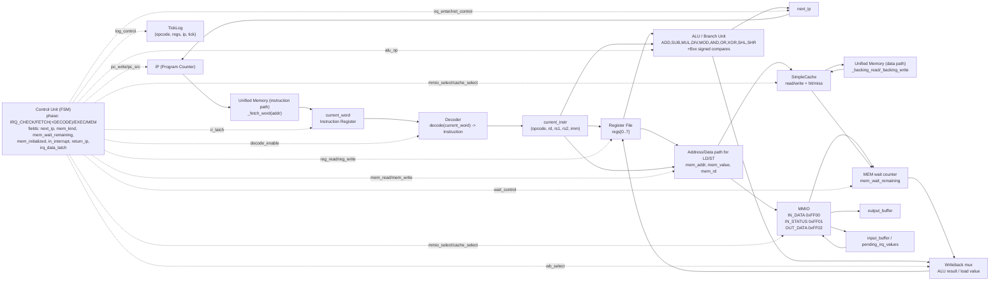
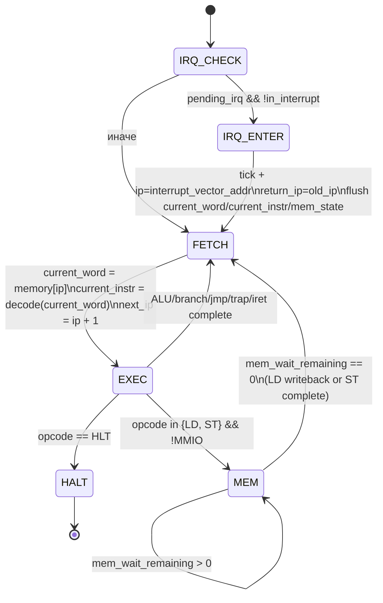

# DataPath и управляющие сигналы

Этот документ описывает `DataPath` и управляющие сигналы для текущей реализации в `src/ak_lab4/simulator/core.py`.
Память в варианте `neum` единая; в схеме она показана двумя логическими путями (instruction/data) для наглядности потоков.

## Полная схема DataPath

## Сигналы управления по фазам

| Фаза | Что делает CU | Активные сигналы (логически) | Переход |
|---|---|---|---|
| `IRQ_CHECK` | Проверяет расписание IRQ и вход в обработчик | `irq_poll`, `irq_enter`, `pipeline_flush` | `FETCH` или `IRQ_ENTER` |
| `FETCH` | Читает слово инструкции по `IP` и сразу декодирует | `pc_to_mem_addr`, `mem_instr_read`, `ir_latch`, `decode_enable` | `EXEC` |
| `EXEC` | Выполняет ALU/branch/jump/trap/iret | `reg_read`, `alu_op`, `branch_cmp`, `pc_src`, `reg_write` | `FETCH` или `MEM` |
| `MEM` | Выполняет `LD/ST` через cache+memory (не-MMIO) | `mem_read`/`mem_write`, `cache_select`, `wait_control`, `wb_select` | `MEM` (ожидание) или `FETCH` |

## Стрелки и источники данных (что куда идет)

- `IP -> Memory -> current_word`: выборка инструкции в `FETCH`.
- `current_word -> decode -> current_instr`: декодирование в конце `FETCH`.
- `regs + current_instr -> ALU`: вычисление результата/условия перехода в `EXEC`.
- `ALU/branch -> next_ip -> IP`: обновление счетчика команд.
- `regs + current_instr -> mem_addr/mem_value`: подготовка доступа памяти в `LD/ST`.
- `mem_addr -> MMIO` или `mem_addr -> Cache -> Memory`: выбор источника/приемника данных.
- `MMIO/Cache result -> writeback -> regs[mem_rd]`: загрузка для `LD`.
- `regs[instr.rs1] -> MMIO/Cache`: запись для `ST`.

## Отражение IRQ и trap в DataPath

- В `IRQ_CHECK` при входе в прерывание:
  - `return_ip <- ip`
  - `ip <- interrupt_vector_addr`
  - сбрасываются `current_word/current_instr/mem_*` состояние.
- `irq_data_latch` является источником чтения для `MMIO_IN_DATA` приоритетно перед обычным входным буфером.
- `IRET` в `EXEC` делает:
  - `next_ip <- return_ip`
  - `in_interrupt <- False`
  - `return_ip <- None`.

## Полная схема Control Unit (FSM)

## Что делает CU в каждом состоянии

| Состояние | Локальные действия CU | Какие поля CU меняются |
|---|---|---|
| `IRQ_CHECK` | Проверка расписания IRQ, попытка входа в ISR | `pending_irq_values`, `irq_data_latch`, `in_interrupt`, `return_ip`, `ip` |
| `FETCH` | Выборка `current_word`, декодирование и подготовка `next_ip` | `current_instr_ip`, `current_word`, `current_instr`, `next_ip`, `phase` |
| `EXEC` | Диспетчер по `opcode`, ALU/branch/IRET/TRAP | `regs`, `next_ip`, `last_trap`, `phase` |
| `MEM` | Выполнение `LD/ST` через cache, ожидание latency | `mem_kind`, `mem_addr`, `mem_wait_remaining`, `mem_initialized`, `mem_value_latch` |
| `HALT` | Остановка модели | `halted=True` |

## Управляющие условия переходов

- `IRQ_CHECK -> IRQ_ENTER`: есть `pending_irq_values` и процессор не в ISR.
- `EXEC -> MEM`: только для `LD`/`ST`.
- `EXEC -> FETCH`: для всех немемориальных инструкций после `_complete_instruction()`.
- `EXEC -> FETCH` для `LD/ST` в MMIO (fast-path, без `MEM`-ожидания).
- `MEM -> MEM`: пока счетчик `mem_wait_remaining` не обнулился.
- `MEM -> FETCH`: когда доступ завершен, для `LD` сначала запись в `regs[mem_rd]`.
- `EXEC -> HALT`: при `HLT`.

## Сигналы CU, которые стоит подписать на рисунке

- `phase_select`: выбор текущего состояния FSM.
- `irq_enter`: перенос управления в вектор прерывания.
- `pc_src`/`pc_write`: источник и запись следующего `IP`.
- `decode_enable`: разрешение декодирования `IR`.
- `alu_op`: выбор операции ALU в `EXEC`.
- `reg_write`: разрешение записи в регфайл.
- `mem_read`/`mem_write`: операции памяти в `MEM`.
- `mmio_select`/`cache_select`: выбор тракта MMIO или cache path.
- `wait_control`: загрузка/декремент `mem_wait_remaining`.
- `wb_select`: выбор источника writeback (`ALU` или `MEM`).

## Зависимость CU от варианта и реализации

- От `hw`: CU рисуется как FSM с hardwired переходами, без microcode ROM.
- От `tick`: один шаг `CPU.step()` соответствует одному такту и одному состоянию.
- От `trap`: обязателен входной узел `IRQ_CHECK` и переход `IRQ_ENTER`.
- От `cache`: в FSM нужна явная петля ожидания в `MEM`.
- От текущего кода: схема должна отражать поля `phase`, `next_ip`, `mem_wait_remaining`, `in_interrupt`, `return_ip`.
